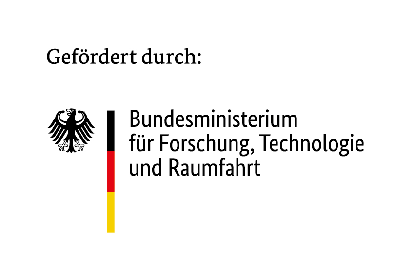

# ORCA — Open RF Integrated Circuit Automation
[](https://github.com/DI-PASSIONATE/ORCA/actions/workflows/pages/pages-build-deployment)

©2026

Gianluca Simone\*, David Lurz\*, Martin Grund\*, Fabian Schneider°, Michael Loose\*, Sascha Breun\*, Manuel Koch\*, Robert Weigel\*, Norman Franchi\*

\* Institute for Intelligent Electronics and Systems (LITES), Friedrich-Alexander-Universität (FAU), Erlangen-Nürnberg, Germany

° Chair of Integrated Electronic Systems, Otto-von-Guericke-University Magdeburg, Germany

[Paper (Coming Soon)](#cite-this-work) | [Documentation](https://DI-PASSIONATE.github.io/ORCA/) | [BibTeX](#cite-this-work)

> [!NOTE]
> ORCA is still under active development. The current codebase is functional and can be used for experimentation, but we keep adding features, improving documentation, and refining the API. If you encounter any issues or have questions, please [open an issue](https://github.com/DI-PASSIONATE/ORCA/issues) or reach out.

**ORCA** is an AI-assisted pipeline for building surrogate models of RF integrated circuit passives.
It combines:

- parametric GDS layout generation (via [gdsfactory](https://github.com/gdsfactory/gdsfactory)),
- full-wave electromagnetic simulation (via [Palace](https://github.com/awslabs/palace)),
- and machine learning model training and export (PyTorch → ONNX).

Given a geometry class with configurable parameters, ORCA automatically:

1. generates thousands of differently parameterized GDS layout variants,
2. converts them to simulation meshes and runs full-wave EM simulations,
3. trains a neural network to predict S-parameters from geometry inputs,
4. exports the trained model to a portable ONNX file,
5. and tests the model against held-out simulation data.

The resulting ONNX model can then be loaded by [COBRA](https://github.com/DI-PASSIONATE/COBRA) for fast circuit-level optimization — no EM simulation required at optimization time. Created models can easily be shared via Hugging Face Hub for others to use in their own design flows and reduce redundant EM simulations across the community.

## How ORCA Fits with COBRA

ORCA is the model-building side of the flow.

- **ORCA** takes a geometry class, runs EM simulations, and produces a trained surrogate model (e.g. `tf_octa_c_ports.onnx`).
- [COBRA](https://github.com/DI-PASSIONATE/COBRA) loads that ONNX model and uses it to predict S-parameters during optimization loops, without re-running EM simulations.
- When COBRA's optional EM fine-tuning is enabled, it calls back into ORCA's geometry classes to regenerate GDS layouts for verification.

In short: **ORCA builds the model, COBRA uses it** to optimize circuits quickly and can verify/refine with real EM simulations.

## Installation

### Requirements

- Python 3.11+
- [Palace](https://awslabs.github.io/palace/stable/) (for running EM simulations)

### Option A: Using `uv` (recommended)

1. Clone the repository:

```bash
git clone https://github.com/DI-PASSIONATE/ORCA
cd ORCA
```

2. Install `uv` (if needed):

```bash
curl -LsSf https://astral.sh/uv/install.sh | sh
```

3. Install a supported Python version:

```bash
uv python install 3.13
```

4. Create and activate a virtual environment:

```bash
uv venv --python 3.13
source .venv/bin/activate
```

5. Install ORCA in editable mode:

```bash
uv pip install -e .
```

### Option B: Using standard `venv` + `pip`

1. Clone the repository:

```bash
git clone https://github.com/DI-PASSIONATE/ORCA
cd ORCA
```

2. Create and activate a virtual environment:

```bash
python3 -m venv .venv
source .venv/bin/activate
```

3. Install ORCA:

```bash
pip install -U pip
pip install -e .
```

Install Palace separately by following [the Palace installation instructions](https://awslabs.github.io/palace/stable/install/index.html).

## Running ORCA

ORCA supports three usage modes.

### 1. GUI mode

After installation, start the GUI with:

```bash
orca
```

The GUI lets you:

- select a geometry preset or load a custom geometry class,
- configure pipeline stages and parameters,
- monitor simulation and training progress in real time,
- inspect and test the trained model.

### 2. Python script mode

For direct integration into scripts or automated workflows:

```python
import orca
from orca import ORCA
from orca.geometry.presets.tf_octa_c_ports import TransformerOcta

geometry = TransformerOcta()

orca_instance = ORCA(
    [
        orca.GDSGenerator(num_samples=1000),
        orca.GDSConverter(),
        orca.PalaceSimulator(palace_executable="palace"),
        orca.ModelTrainer(),
        orca.OnnxExporter(),
        orca.ModelTester(),
    ]
)

orca_instance.run(geometry=geometry, cpu_cores=16)
```

This generates 1000 parameterized layout variants, runs EM simulations, trains a model, exports it to ONNX, and evaluates its accuracy.
You can omit any stage (e.g. skip `GDSGenerator` and `GDSConverter` if simulation data already exists).

### 3. OpenStack remote execution

For large-scale simulation runs, we provide an OpenStack VM image and a CLI controller in the [ORCA-OpenStack repository](https://github.com/DI-PASSIONATE/ORCA-OpenStack). This lets you launch simulation and training jobs on a remote server without managing the environment manually.

## Pipeline Stages

| Stage | Class | Description |
|-------|-------|-------------|
| GDS generation | `GDSGenerator` | Creates parameterized GDS layout files from a geometry class |
| GDS conversion | `GDSConverter` | Converts GDS files to Palace-compatible simulation meshes using gds2palace |
| EM simulation | `PalaceSimulator` | Runs full-wave EM simulations in Palace and stores results as Touchstone files |
| Model training | `ModelTrainer` | Trains a PyTorch MLP to map geometry parameters + frequency to S-parameters |
| ONNX export | `OnnxExporter` | Exports the trained model to a portable ONNX file for use in COBRA |
| Model testing | `ModelTester` | Evaluates prediction accuracy on held-out simulation data |

Each stage reads from and writes to a shared context dictionary, so stages can be run independently or composed freely.

## How ORCA Works Internally

ORCA runs a linear pipeline. Each stage receives a context dictionary and adds its outputs for the next stage.

```
┌──────────────────────────────────────────────────────────────┐
│                        ORCA pipeline                         │
│                                                              │
│  ┌──────────────┐   GDS files    ┌──────────────────┐        │
│  │ GDSGenerator │───────────────▶│   GDSConverter   │        │
│  │              │                │ (gds2palace mesh) │        │
│  └──────────────┘                └────────┬─────────┘        │
│                                           │ mesh files        │
│                                           ▼                  │
│                                  ┌──────────────────┐        │
│                                  │ PalaceSimulator  │        │
│                                  │ (full-wave EM)   │        │
│                                  └────────┬─────────┘        │
│                                           │ Touchstone .sNp  │
│                                           ▼                  │
│                                  ┌──────────────────┐        │
│                                  │  ModelTrainer    │        │
│                                  │ (PyTorch MLP)    │        │
│                                  └────────┬─────────┘        │
│                                           │ trained model    │
│                                           ▼                  │
│                                  ┌──────────────────┐        │
│                                  │  OnnxExporter    │────────▶ .onnx (→ COBRA)
│                                  └────────┬─────────┘        │
│                                           │                  │
│                                           ▼                  │
│                                  ┌──────────────────┐        │
│                                  │   ModelTester    │        │
│                                  └──────────────────┘        │
└──────────────────────────────────────────────────────────────┘
```

### Stage 1 — GDS generation (`GDSGenerator`)

The geometry class's `input_parameter_iterator` samples parameter combinations (randomly or on a grid). For each combination, `create_gds_file()` is called to produce a GDS layout file. The number of samples is set by `num_samples`.

### Stage 2 — GDS conversion (`GDSConverter`)

Each GDS file is converted to a Palace-ready simulation setup using [gds2palace](https://github.com/VolkerMuehlhaus/gds2palace_ihp_sg13g2). The geometry's `stackup_xml` defines the physical layer stackup and material properties; the `simconfig_filename` defines the simulation parameters (port positions, frequency sweep, mesh settings).

### Stage 3 — EM simulation (`PalaceSimulator`)

Palace runs a full-wave finite-element EM simulation for each layout variant and writes the S-parameters to a Touchstone file (`.sNp`). Simulations are distributed across available CPU cores. The `palace_executable` argument can point to a local binary or a container invocation (e.g. `apptainer exec palace.sif palace`).

### Stage 4 — Model training (`ModelTrainer`)

A PyTorch MLP is trained on the simulation data. Inputs are geometry parameters and frequency; outputs are the real and imaginary parts of each S-parameter entry. Feature engineering (ratio features, Chebyshev features) and normalization are defined in the geometry class and applied automatically. Hyperparameters such as learning rate, batch size, and network depth can be passed to `ModelTrainer`.

### Stage 5 — ONNX export (`OnnxExporter`)

The trained PyTorch model is exported to ONNX format with a fixed frequency sweep as part of the model signature. The resulting `.onnx` file is self-contained and can be run with `onnxruntime` — no PyTorch installation required at inference time.

### Stage 6 — Model testing (`ModelTester`)

The ONNX model is loaded and evaluated against held-out simulation data. Prediction errors are logged to help assess whether the surrogate is accurate enough for use in COBRA.

## Custom Geometry

To train a surrogate for your own passive component, create three files:

1. **A Python class** extending `BaseGeometry` — defines geometry parameters, GDS generation, and model architecture.
2. **A stackup XML file** — defines the physical layer stack (materials, thicknesses, conductor layers).
3. **A simulation config file** (`.simcfg`) — defines port positions, frequency sweep, and mesh settings for Palace.

See the [Custom Classes documentation](docs/custom_class.md) for a full walkthrough and examples.

The built-in `TransformerOcta` preset (`src/orca/geometry/presets/tf_octa_c_ports.py`) is a good reference implementation.

## Sharing Models on Hugging Face

After training a surrogate model with ORCA, you can publish it to [Hugging Face](https://huggingface.co) so that COBRA — or anyone else — can discover and use it directly.

### Requirements

- A Hugging Face account
- The `huggingface_hub` Python package: `pip install huggingface_hub`

### File structure

Each model repository must contain exactly two files named after the model:

| File | Description |
|------|-------------|
| `<model_name>.onnx` | The exported ONNX surrogate model produced by `OnnxExporter` |
| `<model_name>.py` | The Python geometry class (subclass of `BaseGeometry`) used to generate and train the model |

The geometry class file is required so that COBRA can reconstruct the parameter space, call back into the geometry for EM verification, and correctly pre-process inference inputs.

### Step-by-step upload

1. **Create a new model repository** at [https://huggingface.co/new](https://huggingface.co/new).  
   Set visibility to **Public** and note the repository ID (e.g. `your-username/tf-octa-c-ports`). Click on "Create model".

2. Create a **Model Card** (essentially just a structured README) for your repository. Click on "Add Model Card". From there, add the tag "orca-surrogate" to make it discoverable by COBRA and other users looking for ORCA. The model card should then include this section:

   ```markdown
   ---
   tags:
   - orca-surrogate
   ```

3. **Upload the files** using the `huggingface_hub` library:
   ```python
   from huggingface_hub import HfApi

   api = HfApi()
   repo_id = "your-username/tf-octa-c-ports"  # replace with your repo

   api.upload_file(path_or_fileobj="tf_octa_c_ports.onnx", path_in_repo="tf_octa_c_ports.onnx", repo_id=repo_id)
   api.upload_file(path_or_fileobj="tf_octa_c_ports.py",   path_in_repo="tf_octa_c_ports.py",   repo_id=repo_id)
   ```
   Or via the Hugging Face web interface: go to your repository → **Files** → **Add file → Upload files**.

4. **Verify** the repository contains both `<model_name>.onnx` and `<model_name>.py` and is tagged `orca-surrogate`.

### Using a shared model in COBRA

Once uploaded, COBRA can query all public `orca-surrogate` models or load a specific one directly by its Hugging Face repository ID. Refer to the [COBRA documentation](https://github.com/DI-PASSIONATE/COBRA) for details on how to point COBRA at a Hugging Face model repository.


## Troubleshooting

- If the `orca` command is not found, ensure your virtual environment is activated and reinstall with `pip install -e .`.
- If Palace simulations fail, verify Palace is installed and available in your `PATH`, or adjust the `palace_executable` argument.
- If GDS conversion fails, verify that [gds2palace](https://github.com/VolkerMuehlhaus/gds2palace_ihp_sg13g2) is installed and that the stackup XML matches your technology.
- If ONNX export fails, ensure `onnx` and `onnxscript` are installed (`pip install onnx onnxscript`).

## Cite This Work

If you use ORCA in your research, please cite our upcoming SBCCI 2026 paper:

```bibtex
@INPROCEEDINGS{2026_COBRA,
  author={Simone, Gianluca and Lurz, David and Grund, Martin and Schneider, Fabian and Loose, Michael and Breun, Sascha and Koch, Manuel and Weigel, Robert and Franchi, Norman},
  booktitle={2026 39th SBC/SBMicro/IEEE Symposium on Integrated Circuits and Systems Design (SBCCI)},
  title={{COBRA: An AI-Assisted Circuit-Level Optimizer for Open Source Based RFIC Design}},
  year={2026},
  organization={IEEE},
  keywords={artificial intelligence, design automation, EDA, neural network, open-source, optimization, Palace, radio frequency integrated circuit, surrogate model}
}
```

## Acknowledgements
This work was supported by the Bundesministerium für Forschung, Technologie und Raumfahrt (BMFTR) under the DI-PASSIONATE project. We thank our colleagues in the LITES institute for their feedback and support during development. Special thanks to the open-source community for providing the tools and libraries that made this project possible, including but not limited to:

- [gdsfactory](https://github.com/gdsfactory/gdsfactory)
- [gds2palace](https://github.com/VolkerMuehlhaus/gds2palace_ihp_sg13g2)
- [setupEM](https://github.com/VolkerMuehlhaus/setupEM)
- [Palace](https://github.com/awslabs/palace)
- [PyTorch](https://github.com/pytorch/pytorch)
- [ONNX](https://github.com/onnx/onnx)
- [scikit-rf](https://github.com/scikit-rf/scikit-rf)
- [OpenStack](https://opendev.org/openstack)
- [Hugging Face Hub](https://github.com/huggingface/huggingface_hub)

<table width="100%">
  <tr>
    <td align="left" width="50%">
      <a href="https://www.lites.tf.fau.de/" target="_blank">
        
      </a>
    </td>
    <td align="right" width="50%">
      <a href="https://www.elektronikforschung.de/projekte/di-passionate" target="_blank">
        
      </a>
    </td>
  </tr>
</table>
