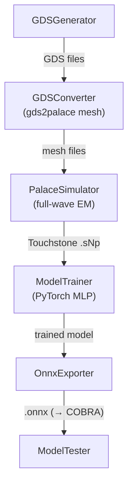

# Pipeline Stages

ORCA runs a linear pipeline. Each stage receives a context dictionary and adds its outputs for the next stage.

## Stage 1 — GDS generation (`GDSGenerator`)

The geometry class's `input_parameter_iterator` samples parameter combinations (randomly or on a grid). For each combination, `create_gds_file()` is called to produce a GDS layout file. The number of samples is set by `num_samples`.

## Stage 2 — GDS conversion (`GDSConverter`)

Each GDS file is converted to a Palace-ready simulation setup using [gds2palace](https://github.com/VolkerMuehlhaus/gds2palace_ihp_sg13g2). The geometry's `stackup_xml` defines the physical layer stackup and material properties; the `simconfig_filename` defines the simulation parameters (port positions, frequency sweep, mesh settings).

## Stage 3 — EM simulation (`PalaceSimulator`)

Palace runs a full-wave finite-element EM simulation for each layout variant and writes the S-parameters to a Touchstone file (`.sNp`). Simulations are distributed across available CPU cores. The `palace_executable` argument can point to a local binary or a container invocation (e.g. `apptainer exec palace.sif palace`).

Several simulations can run at once, each already parallelized internally with MPI (`num_processes` ranks per simulation). `bind` chooses what one simulation gets — a whole `"node"`, one `"socket"` or one `"numa"` domain — and `num_parallel_sims=0` uses all such slots:

- `PalaceSimulator(num_parallel_sims=0, bind="numa")` runs one simulation per NUMA domain of the current machine, each pinned with `numactl` (e.g. 2 or 4 at once on a multi-socket workstation).
- `PalaceSimulator(launcher="slurm", num_parallel_sims=0, bind="numa")` does the same on every node of a Slurm allocation (`sbatch --nodes=N`), each simulation launched as an `srun` job step pinned to its node and cores. See [examples/slurm_runs](https://github.com/DI-PASSIONATE/ORCA/tree/main/examples/slurm_runs) for a job script.

Palace is memory-bandwidth bound, so several smaller simulations confined to their own NUMA domain usually give a higher throughput than one simulation spread over a whole node — as long as one simulation fits into a domain's memory (use `bind="socket"` otherwise). The layout is derived from the machine or allocation at runtime, so `num_parallel_sims` and `num_processes` are capped to what is actually available. Pass `save_log=True` to keep each simulation's full Palace output in `palace.log` in its simulation folder (off by default, Palace prints a lot); failures are reported either way.

## Stage 4 — Model training (`ModelTrainer`)

A PyTorch MLP is trained on the simulation data. Inputs are geometry parameters and frequency; outputs are the real and imaginary parts of each S-parameter entry. Normalization is defined in the geometry's dataset and applied automatically. An optional basis expansion of the inputs — for example a Chebyshev expansion of frequency — is chosen on the stage itself with `ModelTrainer(basis="chebyshev")`; it lives inside the model, so it is tuned with it and exported into the ONNX graph. Hyperparameters such as learning rate, batch size, and network depth can be passed to `ModelTrainer`.

## Stage 5 — ONNX export (`OnnxExporter`)

The trained PyTorch model is exported to ONNX format with a fixed frequency sweep as part of the model signature. The resulting `.onnx` file is self-contained and can be run with `onnxruntime` — no PyTorch installation required at inference time.

## Stage 6 — Model testing (`ModelTester`)

The ONNX model is loaded and evaluated against held-out simulation data. Prediction errors are logged to help assess whether the surrogate is accurate enough for use in [COBRA](https://github.com/DI-PASSIONATE/COBRA).
