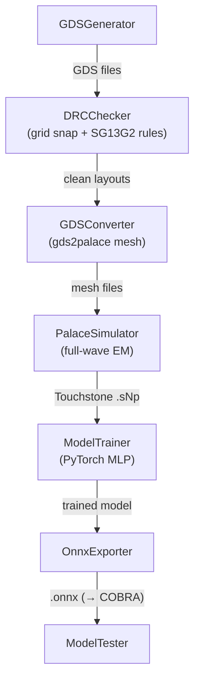

# Pipeline Stages

ORCA runs a linear pipeline. Each stage receives a context dictionary and adds its outputs for the next stage.

## Stage 1 — GDS generation (`GDSGenerator`)

The geometry class's `input_parameter_iterator` samples parameter combinations (randomly or on a grid). For each combination, `create_gds_file()` is called to produce a GDS layout file. The number of samples is set by `num_samples`; `seed` makes the `"random"` picking strategy reproducible. Every draw is first passed to the geometry's `is_feasible()`; combinations it rejects (a winding that does not fit its diameter, a feed gap wider than the octagon's side) are counted and, with the `"random"` strategy, redrawn, so `num_samples` buildable layouts come out. A geometry that still raises `ValueError` in `create_gds_file()` costs a sample, and the stage warns when it delivered fewer layouts than requested.

## Stage 2 — Design-rule check (`DRCChecker`)

Every generated layout is snapped to the manufacturing grid and checked against the IHP SG13G2 back-end design rules with KLayout: vertices off the grid, edge angles other than 0/45/90° (0/90° on vias), acute corners, minimum metal width and spacing (`M1`, `M2`–`M5`, `TM1`, `TM2`), and via size, spacing and metal enclosure (`V1`–`V4`, `TV1`, `TV2`). The rule values and names are those of the PDK's own KLayout deck, so a finding such as `TV2.d` can be looked up in the SG13G2 design rule manual; the rule table lives in `orca.geometry.drc`.

Off-grid vertices are repaired rather than reported: `snap_to_grid=True` (the default) moves every vertex onto the `grid_nm` grid (5 nm for SG13G2) and writes the GDS file back, so geometry code does not need its own snapping. Layouts with remaining violations are left out of the parameter table the later stages use (`drop_violations=True`); the stage writes `<name>_drc_report.csv` with the per-layout counts and `<name>_drc.csv` with the layouts that passed, both next to the GDS files, and logs a summary. This is where parameter combinations that draw unbuildable geometry — a winding folded over itself, a via clipped by a miter — are stopped before they cost simulation time or teach the model shapes that cannot be fabricated.

## Stage 3 — GDS conversion (`GDSConverter`)

Each GDS file — those that passed DRC when the stage ran, otherwise all of them — is converted to a Palace-ready simulation setup using [gds2palace](https://github.com/VolkerMuehlhaus/gds2palace_ihp_sg13g2). The geometry's `stackup_xml` defines the physical layer stackup and material properties; the `simconfig_filename` defines the simulation parameters (port positions, frequency sweep, mesh settings).

Conversions run in parallel worker processes, one sample per task. A sample whose geometry gds2palace/gmsh cannot mesh (e.g. `PLC Error: A segment and a facet intersect`) is logged and skipped. gmsh can also loop forever on degenerate geometry, so each conversion has a time limit — `GDSConverter(timeout=60)` seconds by default — after which its worker is killed and the sample is skipped as well, instead of stalling the whole pipeline.

## Stage 4 — EM simulation (`PalaceSimulator`)

Palace runs a full-wave finite-element EM simulation for each layout variant and writes the S-parameters to a Touchstone file (`.sNp`). Simulations are distributed across available CPU cores. The `palace_executable` argument can point to a local binary or a container invocation (e.g. `apptainer exec palace.sif palace`).

Several simulations can run at once, each already parallelized internally with MPI (`num_processes` ranks per simulation). `bind` chooses what one simulation gets — a whole `"node"`, one `"socket"` or one `"numa"` domain — and `num_parallel_sims=0` uses all such slots:

- `PalaceSimulator(num_parallel_sims=0, bind="numa")` runs one simulation per NUMA domain of the current machine, each pinned with `numactl` (e.g. 2 or 4 at once on a multi-socket workstation).
- `PalaceSimulator(launcher="slurm", num_parallel_sims=0, bind="numa")` does the same on every node of a Slurm allocation (`sbatch --nodes=N`), each simulation launched as an `srun` job step pinned to its node and cores. See [examples/slurm_runs](https://github.com/DI-PASSIONATE/ORCA/tree/main/examples/slurm_runs) for a job script.

Palace is memory-bandwidth bound, so several smaller simulations confined to their own NUMA domain usually give a higher throughput than one simulation spread over a whole node — as long as one simulation fits into a domain's memory (use `bind="socket"` otherwise). The layout is derived from the machine or allocation at runtime, so `num_parallel_sims` and `num_processes` are capped to what is actually available. Pass `save_log=True` to keep each simulation's full Palace output in `palace.log` in its simulation folder (off by default, Palace prints a lot); failures are reported either way.

## Stage 5 — Model training (`ModelTrainer`)

A PyTorch MLP is trained on the simulation data. Inputs are geometry parameters and frequency; outputs are the real and imaginary parts of each S-parameter entry. Normalization is defined in the geometry's dataset and applied automatically. An optional basis expansion of the inputs — for example a Chebyshev expansion of frequency — is chosen on the stage itself with `ModelTrainer(basis="chebyshev")`; it lives inside the model, so it is tuned with it and exported into the ONNX graph. Hyperparameters such as learning rate, batch size, and network depth can be passed to `ModelTrainer`.

## Stage 6 — ONNX export (`OnnxExporter`)

The trained PyTorch model is exported to ONNX format with a fixed frequency sweep as part of the model signature. The resulting `.onnx` file is self-contained and can be run with `onnxruntime` — no PyTorch installation required at inference time. Three metadata keys describe the model to its consumer: `input_parameter_ranges` (the box each input was sampled from), `input_constraints` (the geometry's `feasibility_constraints()`, expressions that single out the buildable part of that box — the only part the model has seen) and `physics_guarantees` (properties such as reciprocity the architecture enforces by construction).

## Stage 7 — Model testing (`ModelTester`)

The ONNX model is loaded and evaluated against held-out simulation data. Prediction errors are logged to help assess whether the surrogate is accurate enough for use in [COBRA](https://github.com/DI-PASSIONATE/COBRA).
