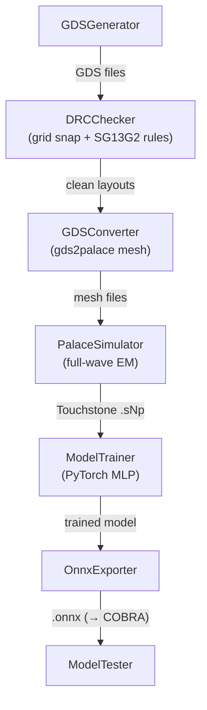

# Pipeline Stages

ORCA runs a linear pipeline. Each stage receives a context dictionary and adds its outputs for the next stage.

```mermaid
flowchart TB
    A[GDSGenerator] -- GDS files --> X["DRCChecker<br/>(grid snap + SG13G2 rules)"]
    X -- clean layouts --> B["GDSConverter<br/>(gds2palace mesh)"]
    B -- mesh files --> C["PalaceSimulator<br/>(full-wave EM)"]
    C -- "Touchstone .sNp" --> D["ModelTrainer<br/>(PyTorch MLP)"]
    D -- trained model --> E[OnnxExporter]
    E -- ".onnx (→ COBRA)" --> F[ModelTester]
```

The sample-producing stages (`GDSGenerator`, `GDSConverter`, `PalaceSimulator`) record every finished sample in their parameter table right away and keep the results of earlier runs, so an interrupted run continues where it stopped when started again. Each of them takes `overwrite=True` to delete its earlier results instead; see [Resuming an interrupted run](running_orca.md#resuming-an-interrupted-run).

## Stage 1 — GDS generation (`GDSGenerator`)

The geometry class's `input_parameter_iterator` samples parameter combinations — by default with a scrambled Sobol' sequence, a space-filling design that covers the parameter box more evenly than random draws, with a small share of the draws moved onto the faces, edges and corners of the box — drawing each parameter from its declared distribution: uniform, or log-uniform to put more samples at the small end of its range (see [Custom Classes](custom_class.md#reference-inputparameteriterator)). For each combination, `create_gds_file()` is called to produce a GDS layout file. The number of samples is set by `num_samples`; the run seed (`ORCA.run(seed=...)`) makes the draws reproducible. Every draw is first passed to the geometry's `is_feasible()`; combinations it rejects (a winding that does not fit its diameter, a feed gap wider than the octagon's side) are counted and replaced by further draws (with all but the grid strategies), so `num_samples` buildable layouts come out. A geometry that still raises `ValueError` in `create_gds_file()` costs a sample, and the stage warns when it delivered fewer layouts than requested. At the end the stage plots the coverage to `geometries/<name>_coverage.png` (`plot_coverage=False` turns it off): a pair plot of every two parameters with the layouts over the rejected draws, which tells gaps in the sampling apart from regions that cannot be built, and a histogram of each parameter. Layouts listed in the table of an earlier run are kept and only the missing indices are laid out; whenever new layouts are added, the DRC tables of the previous set are deleted so the DRC stage has to check them again.

## Stage 2 — Design-rule check (`DRCChecker`)

Every generated layout is snapped to the manufacturing grid and checked against the IHP SG13G2 back-end design rules with KLayout: vertices off the grid, edge angles other than 0/45/90° (0/90° on vias), acute corners, minimum metal width and spacing (`M1`, `M2`–`M5`, `TM1`, `TM2`), and via size, spacing and metal enclosure (`V1`–`V4`, `TV1`, `TV2`). The rule values and names are those of the PDK's own KLayout deck, so a finding such as `TV2.d` can be looked up in the SG13G2 design rule manual; the rule table lives in `orca.geometry.drc`.

Off-grid vertices are repaired rather than reported: `snap_to_grid=True` (the default) moves every vertex onto the `grid_nm` grid (5 nm for SG13G2) and writes the GDS file back, so geometry code does not need its own snapping. Layouts with remaining violations are left out of the parameter table the later stages use (`drop_violations=True`); the stage writes `<name>_drc_report.csv` with the per-layout counts and `<name>_drc.csv` with the layouts that passed, both next to the GDS files, and logs a summary. This is where parameter combinations that draw unbuildable geometry — a winding folded over itself, a via clipped by a miter — are stopped before they cost simulation time or teach the model shapes that cannot be fabricated.

## Stage 3 — GDS conversion (`GDSConverter`)

Each GDS file — those that passed DRC when the stage ran, otherwise all of them — is converted to a Palace-ready simulation setup using [gds2palace](https://github.com/VolkerMuehlhaus/gds2palace_ihp_sg13g2). The geometry's `stackup_xml` defines the physical layer stackup and material properties; the `simconfig_filename` defines the simulation parameters (port positions, frequency sweep, mesh settings).

Conversions run in parallel worker processes, one sample per task. A sample whose geometry gds2palace/gmsh cannot mesh (e.g. `PLC Error: A segment and a facet intersect`) is logged and skipped. gmsh can also loop forever on degenerate geometry, so each conversion has a time limit — `GDSConverter(timeout=60)` seconds by default — after which its worker is killed and the sample is skipped as well, instead of stalling the whole pipeline. Models converted by an earlier run for the same parameters are reused.

## Stage 4 — EM simulation (`PalaceSimulator`)

Palace runs a full-wave finite-element EM simulation for each layout variant and writes the S-parameters to a Touchstone file (`.sNp`). Simulations are distributed across available CPU cores. The `palace_executable` argument can point to a local binary or a container invocation (e.g. `apptainer exec palace.sif palace`).

Several simulations can run at once, each already parallelized internally with MPI (`num_processes` ranks per simulation). `bind` chooses what one simulation gets — a whole `"node"`, one `"socket"` or one `"numa"` domain — and `num_parallel_sims=0` uses all such slots:

- `PalaceSimulator(num_parallel_sims=0, bind="numa")` runs one simulation per NUMA domain of the current machine, each pinned with `numactl` (e.g. 2 or 4 at once on a multi-socket workstation).
- `PalaceSimulator(launcher="slurm", num_parallel_sims=0, bind="numa")` does the same on every node of a Slurm allocation (`sbatch --nodes=N`), each simulation launched as an `srun` job step pinned to its node and cores. See [examples/slurm_runs](https://github.com/DI-PASSIONATE/ORCA/tree/main/examples/slurm_runs) for a job script.

Palace is memory-bandwidth bound, so several smaller simulations confined to their own NUMA domain usually give a higher throughput than one simulation spread over a whole node — as long as one simulation fits into a domain's memory (use `bind="socket"` otherwise). The layout is derived from the machine or allocation at runtime, so `num_parallel_sims` and `num_processes` are capped to what is actually available. Pass `save_log=True` to keep each simulation's full Palace output in `palace.log` in its simulation folder (off by default, Palace prints a lot); failures are reported either way.

Each simulation that finishes adds its row to `results/<name>.csv` immediately, so a job killed by its time limit still leaves a table describing every Touchstone file it produced; at the end of the stage the table is put back into the order of the Palace table. A simulation that fails, raises, or does not produce the requested Touchstone file is logged and left out, and the others go on. Started again, the stage skips every model already listed with the same parameters and simulates the rest.

## Stage 5 — Model training (`ModelTrainer`)

A PyTorch MLP is trained on the simulation data. Inputs are geometry parameters and frequency; outputs are the real and imaginary parts of each S-parameter entry. Normalization is defined in the geometry's dataset and applied automatically. An optional basis expansion of the inputs — for example a Chebyshev expansion of frequency — is chosen on the stage itself with `ModelTrainer(basis="chebyshev")`; it lives inside the model, so it is tuned with it and exported into the ONNX graph. Hyperparameters such as learning rate, batch size, and network depth can be passed to `ModelTrainer`.

The result table is split by geometry, never by frequency point: `test_frac` of the geometries are held out for `ModelTester`, and `val_frac` of the rest select the best checkpoint during training. The split is recorded in `models/<name>_split.csv`. Without `hyperparameters`, Optuna tunes them with `n_fold_cv`-fold cross-validation over the geometries, so every fold is scored on layouts the model has not seen (`n_trials` trials, or until `tuning_timeout` seconds have passed). The number of epochs is not tuned: each fold runs up to `tuning_max_epochs` with early stopping, the final model up to `max_epochs`, and a trial that falls behind the others at the same fold and epoch is pruned after any epoch. The batch sizes searched are `batch_sizes` (32 to 512 if not given); for a per-point dataset with millions of samples, larger ones such as `[1024, 2048, 4096]` train much faster. A trial that diverges or runs out of memory is pruned; any other error stops the stage. Every training, in tuning and in the final run, starts with a linear learning-rate warmup over `warmup_epochs` (default 1) and then follows `lr_schedule`: `"cosine"` (default) decays the rate smoothly to 1% of its tuned value over the epoch limit, `"plateau"` halves it whenever the validation loss stalls. Gradients are clipped to a total norm of `grad_clip_norm` (default 1.0; `None` disables it), so one bad batch cannot undo the progress so far. The MLP's width is searched on a log scale from 64 to 2048 and its depth from 2 to 8 layers, so small networks are tried as often as large ones. With `regularization=True` the weight decay and the model's own regularization (dropout for the MLP) are tuned too; otherwise AdamW's default weight decay and no dropout are used. The hyperparameters a run trained with are saved to `models/<name>_hyperparameters.json`, and `hyperparameters` accepts the path of such a file as well as a dict, so a later run can retrain with them without tuning again. The run seed (`ORCA.run(seed=...)`) fixes the splits, the tuner and the weight initialisation, so two runs with the same seed and data train the same model.

## Stage 6 — ONNX export (`OnnxExporter`)

The trained PyTorch model is exported to ONNX format with a fixed frequency sweep as part of the model signature. The resulting `.onnx` file is self-contained and can be run with `onnxruntime` — no PyTorch installation required at inference time. Three metadata keys describe the model to its consumer: `input_parameter_ranges` (the box each input was sampled from), `input_constraints` (the geometry's `feasibility_constraints()`, expressions that single out the buildable part of that box — the only part the model has seen) and `physics_guarantees` (properties such as reciprocity the architecture enforces by construction).

## Stage 7 — Model testing (`ModelTester`)

The trained model (or, if training did not run in this pipeline, the exported ONNX model) is evaluated against the held-out geometries listed in `models/<name>_split.csv`. Without that file, for example for a model tested against a fresh results folder, every row of the result table is used and a warning says so. Besides the mean absolute S-parameter error and the median relative error of each electrical parameter, the stage reports the spread: the median, 95th percentile and worst geometry, the error in each of `n_frequency_bands` frequency bands, and the 95th percentile of each electrical parameter's error. The errors of every test geometry, next to its parameters, are written to `models/<name>_test_errors.csv`, for example to plot the error against each parameter and find under-sampled regions. The error is also resolved over frequency: `models/<name>_errors_vs_frequency.png` shows, for the S-parameters and each electrical parameter, the median and the 25th–75th and 5th–95th percentiles over the test geometries at every frequency point, so you can see which frequency ranges the model gets right; the values are in `models/<name>_errors_vs_frequency.csv`. The coupling factor k is reported as an absolute error, since a relative one explodes for weakly coupled layouts. Prediction errors are logged to help assess whether the surrogate is accurate enough for use in [COBRA](https://github.com/DI-PASSIONATE/COBRA).
